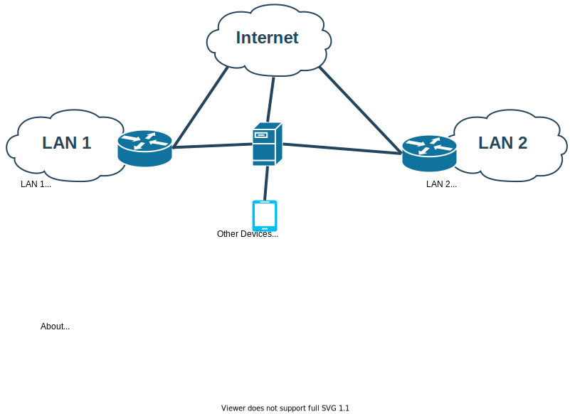

- [About this](#about-this)
- [Warning](#warning)
- [Generate the configuration in your system](#generate-the-configuration-in-your-system)
  - [Linux](#linux)
  - [macOS](#macos)
  - [Windows](#windows)
- [Next step](#next-step)
- [Contributing](#contributing)

## About this

This is wireguard script configuration for a intermediate public server to interconnect two sites.



So you can reach LAN 2 from LAN 1 and vice versa but LAN also reach Internet directly without using VPN Server. The VPN server is only used to reach each LAN.

## Warning

This is not a newbie tool, this is just a helper to configure my VPN server. If you do not know about networking, linux & vpn (wireguard) this tool maybe, it is not for you. Anyway if you know and you think you can do a better job to give a good documentation for everyone I accept contributions.

## Generate the configuration in your system

Install wireguard-tools to generate the configuration.

### Linux

1. Install using whatever package manager is in your Linux system the packages `wireguard` & `wireguard-tools`
2. Configure `.env.dist` and save as `.env`
3. Generate the config

```bash
./generate_config.sh
```

### macOS

1. Install brew & wireguard cli

```bash
! { command -v brew &> /dev/null; } && /bin/bash -c "$(curl -fsSL https://raw.githubusercontent.com/Homebrew/install/HEAD/install.sh)"
! brew list wireguard-tools &> /dev/null && brew install wireguard-go wireguard-tools
```

2. Configure `.env.dist` and rename to `.env`

```bash
mv .env.dist .env
```

3. Generate the config

```bash
./generate_config.sh
```

### Windows

1. Install WSL and use in WSL as Linux


## Next step

Install wireguard in the terminals (phone or computer) that would be also a peers (outside of the LANS) and use the configuration files.

In the LANs, install the wireguard or use wireguard-go dockerized using the configuration file.


## Contributing

PRs are accepted to improve the scripts, tools and documentation. Anyway, whatever contribution should keep the main target which is connect P2P two or more LANs.
